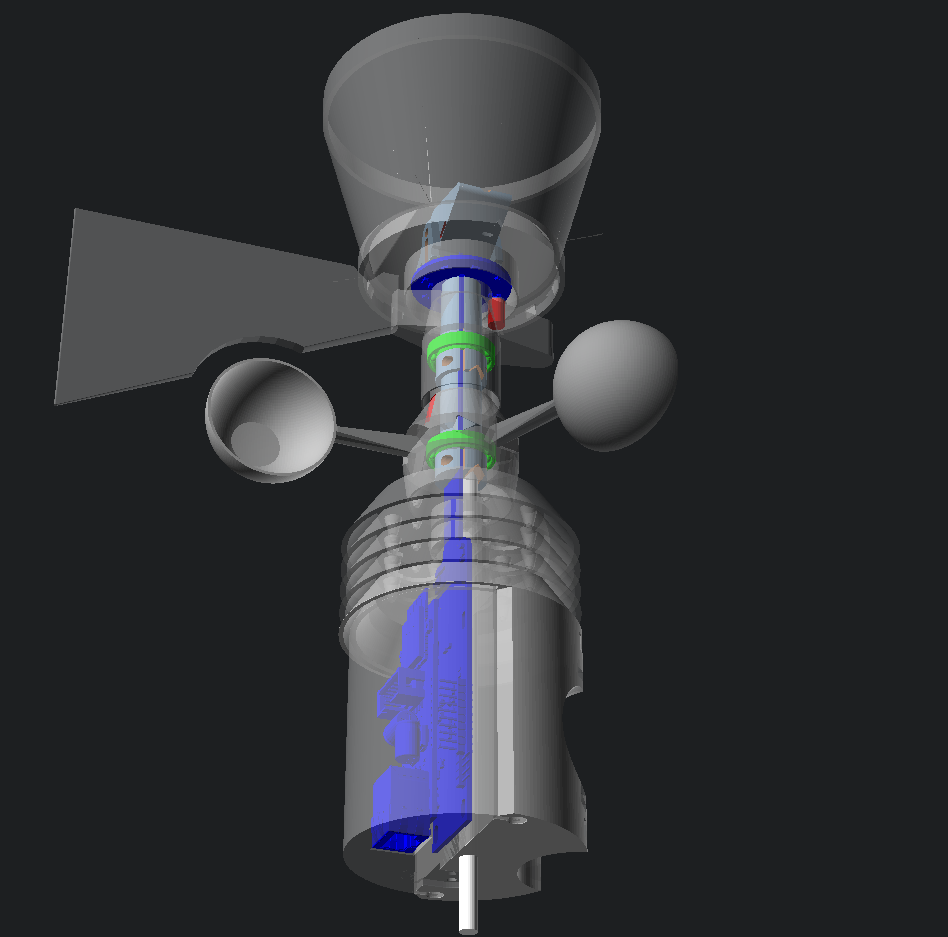

# 3D print WX station

Firmware and 3d models

[Wiki page](https://remoteqth.com/w/doku.php?id=3d_print_wx_station)

## Documentation

- **[Web upload firmware](https://ok1hra.github.io/3D-print-WX-station/)**
- **[Firmware Manual](MANUAL.md)** — network services & ports, web interface,
  serial/telnet console, configuration, building/flashing, and a reference table
  of how often each value is published to MQTT, APRS, windy.com and the dashboard.
- [windy.com setup](WINDY.md) — registering and configuring the windy.com PWS upload.

